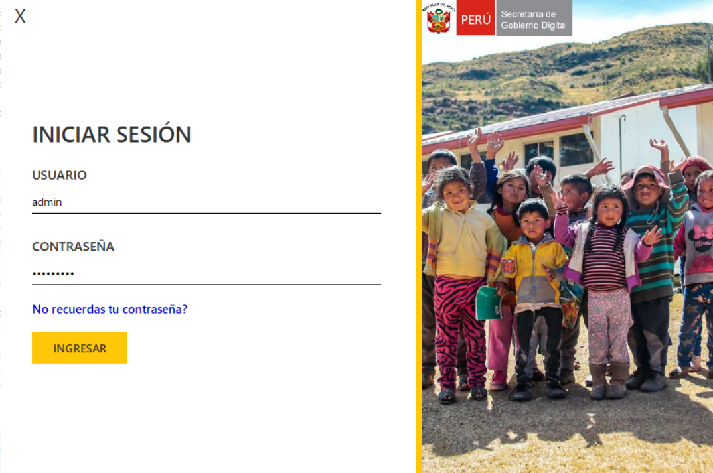
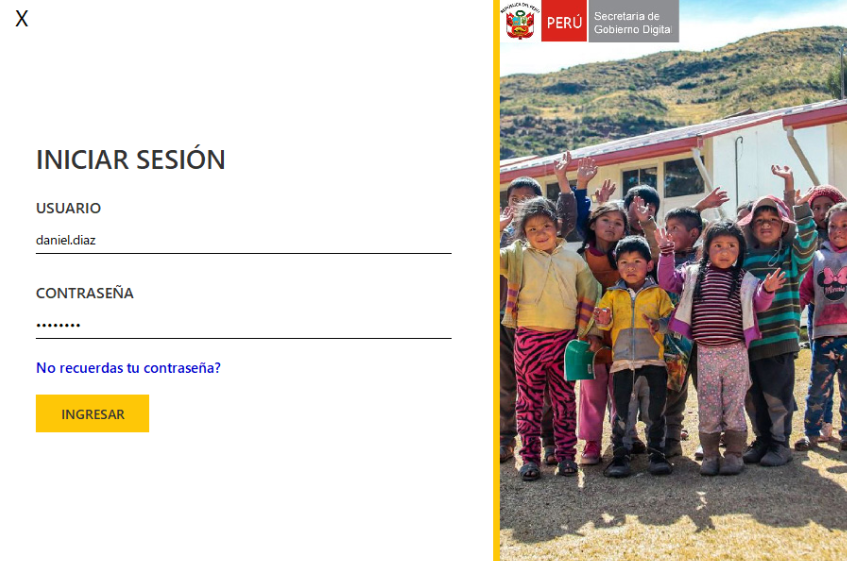
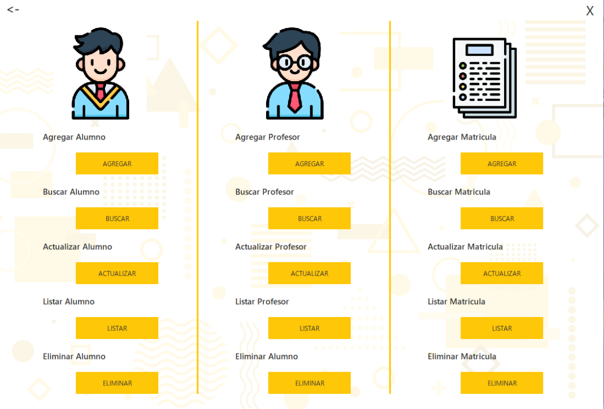
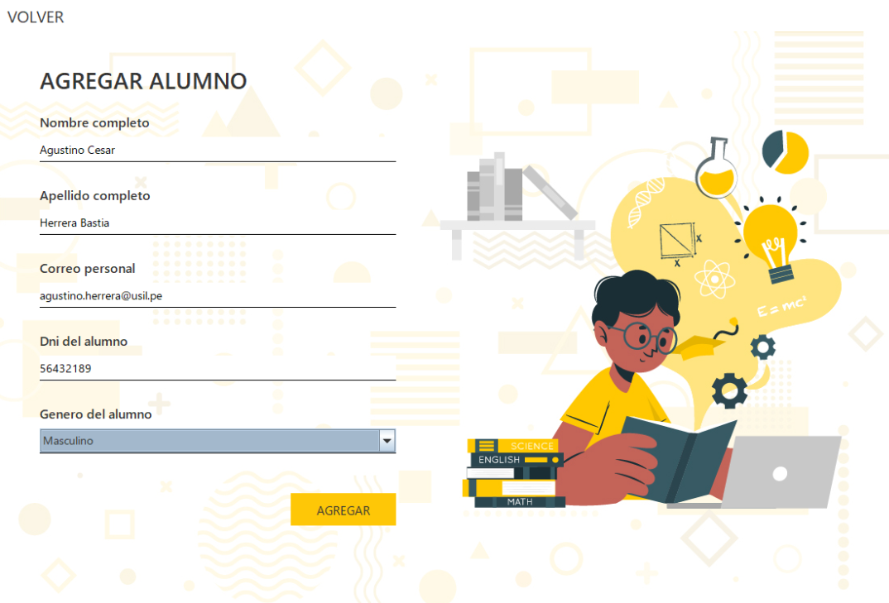

# Sistema de Gestión Documental - I.E. David Samanez Ocampo

Este proyecto es una solución integral desarrollada en **Java** diseñada para automatizar y optimizar la gestión documental y el proceso de matrícula en la institución educativa rural N° 50670 David Samanez Ocampo Chacamachay.

## Introducción y Propósito
El sistema nace de la necesidad de modernizar la gestión administrativa en zonas rurales, donde la falta de seguimiento eficiente en formato digital suele ser una barrera. El propósito principal es:
* **Digitalizar** los registros de matrícula y datos personales.
* **Agilizar** los procesos de búsqueda y actualización de información académica.
* **Brindar seguridad** a los archivos proporcionados por estudiantes y docentes.

## Funcionalidades Principales
* **Módulo de Matrícula:** Gestión completa del ciclo de inscripción de alumnos.
* **Gestión de Usuarios:** Roles diferenciados para Administradores y Profesores.
* **Mantenimiento de Datos:** Registro, edición y consulta de Alumnos, Profesores y Matrículas.
* **Persistencia Híbrida:** Uso de base de datos **MySQL** para el núcleo del sistema y archivos **CSV** para la exportación de reportes rápidos.

## Tecnologías Utilizadas
* **Lenguaje:** Java (Programación Orientada a Objetos)
* **Persistencia:** MySQL & CSV (BufferReader/FileWriter)
* **Arquitectura:** Diseño basado en capas (Controlador, Modelo, Vista).
* **IDE:** NetBeans

## Configuración del Entorno

### 1. Base de Datos
El sistema requiere una instancia de MySQL:
1. Crea una base de datos en tu servidor local.
2. Importa el archivo `trabajo final.sql` incluido en la raíz de este repositorio para generar las tablas y relaciones necesarias.

### 2. Ejecución
1. Clona este repositorio: 
   `git clone https://github.com/jhinrojasbuitron-netizen/SISTEMA-DE-GESTI-N-DOCUMENTAL.git`
2. Abre el proyecto en **NetBeans**.
3. Revisa la clase de conexión para asegurar que el usuario y contraseña de tu MySQL coincidan.
4. Ejecuta un **Clean and Build** y lanza la aplicación desde la clase principal.

## Capturas del Sistema

### Acceso al Sistema

  
  

### Gestión Administrativa

  

### Registro de Alumnos

  

---

*Facultad de Ingeniería de Sistemas - 2023*
